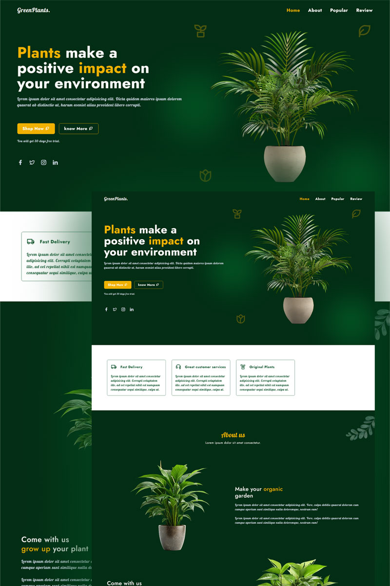

# 🌱 GreenPlant : TailwindCss Project

Welcome to **GreenPlant**, a modern, responsive and aesthetically pleasing landing page for your plant-related business or project. Built with **HTML**, **Tailwind CSS**, and **Remix Icons**, it showcases elegant components and sections that ensure a delightful user experience across all devices.

## 🌟 Features

- **Responsive Design**: Fully adaptable across mobile, tablet, and desktop screens.
- **Tailwind CSS**: Utility-first CSS framework for easy customization.
- **Remix Icons & Swiper.js**: Beautiful icons and responsive sliders.
- **Interactive Navbar**: Smooth transitions and menu toggling.
- **Animated Elements**: Eye-catching scroll animations.
- **Modern Components**: Includes hero banner, services, about us, popular products, reviews, and footer sections.
- **Accessible**: Uses semantic HTML and accessible tags.
- **Newsletter Subscription**: Collect emails with a stylish form.

## 🚀 Usage

1. **Clone or Download** this repository.
2. **Navigate** to the project directory.
3. **Open** `index.html` in your browser to view the project.
4. **Customize** content and styles as needed:
   - Update images in the `assets/images` folder.
   - Customize scripts in `assets/js/custom.js` and Tailwind CSS in `/src`.

## 🛠️ Built With

- **Tailwind CSS** for styling.
- **Remix Icons** for stunning icons.
- **Swiper.js** for carousel effects.
- **ScrollReveal** for scroll animations.

## 💡 Customization

- **Tailwind CSS**: Edit `output.css` or the source CSS in `src/input.css` to modify styles.
- **JS Functionality**: Modify `custom.js` for navbar toggling, scroll-up button, or other interactivity.
- **Content**: Update `index.html` to include your own text, images, and links.

## 📸 Preview

The project includes:

- A **hero section** with impactful text and CTA buttons.
- **Services section** with 4 featured cards.
- **About us** section highlighting your mission.
- **Popular products** with attractive product cards.
- **Customer reviews** using Swiper.js for sliding testimonials.
- A **footer** with quick links, services, and a newsletter signup form.

## 💻 Deployment

Deploy this static site on any hosting platform:

- **Netlify**, **Vercel**, **GitHub Pages**, or your preferred host.

## 🤝 Contributing

Feel free to fork this project and submit pull requests for improvements or new features!

## 📜 License

This project is for personal or educational use. Customize and share as needed!

---

Happy coding and planting! 🌱✨
